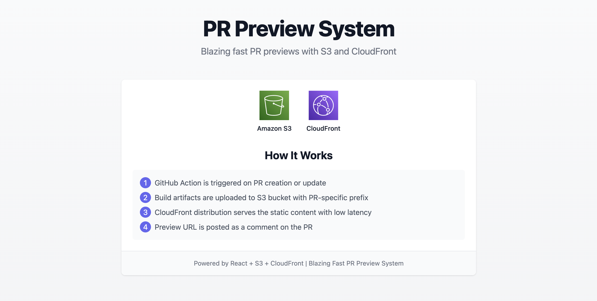

# S3rcel PR Preview System

A blazing fast PR preview system built with React, AWS S3, and CloudFront. This system automatically generates and deploys preview environments for your pull requests.

## Features

- Automatic PR preview deployments
- Fast content delivery through CloudFront
- Component-based architecture
- Modern development tooling
- Comprehensive testing setup

## Prerequisites

- Node.js 16.x or higher
- AWS Account with S3 and CloudFront access
- GitHub repository with Actions enabled

## Getting Started

1. Clone the repository:
   ```bash
   git clone https://github.com/kartikmehta8/s3rcel-pr-preview.git
   cd s3rcel-pr-preview
   ```

2. Install dependencies:
   ```bash
   npm install
   ```

3. Start the development server:
   ```bash
   npm start
   ```

4. Build for production:
   ```bash
   npm run build
   ```

## AWS Configuration

1. Create an S3 bucket:
   - Enable static website hosting
   - Configure appropriate CORS settings
   - Set up bucket policy for public access

2. Create a CloudFront distribution:
   - Point to your S3 bucket as origin
   - Configure cache behaviors
   - Enable HTTPS

3. Set up GitHub Actions:
   - Add AWS credentials as secrets
   - Configure deployment workflow

## Development

- `npm start` - Start development server
- `npm test` - Run tests
- `npm run build` - Build for production
- `npm run lint` - Run ESLint
- `npm run lint:fix` - Fix ESLint issues
- `npm run format` - Format code with Prettier

## Project Structure

```
src/
  ├── components/        # React components
  ├── assets/           # Static assets
  ├── App.js            # Main application
  └── index.js          # Entry point
```

## Contributing

1. Fork the repository
2. Create your feature branch (`git checkout -b feature/amazing-feature`)
3. Commit your changes (`git commit -m 'Add some amazing feature'`)
4. Push to the branch (`git push origin feature/amazing-feature`)
5. Open a Pull Request

## License

This project is licensed under the MIT License - see the LICENSE file for details.

<div align="center">
  
  
  <h3>Blazing Fast PR Previews with S3 and CloudFront</h3>
  <p>Automatically deploy and preview your pull requests with AWS infrastructure</p>
</div>

## Overview

This project implements an automated PR preview system using GitHub Actions, AWS S3, and CloudFront. It allows you to automatically deploy a preview version of your React application for each pull request, making it easier for reviewers to see the changes in action.

### Key Features

- **Automated Deployments**: Automatically deploy preview environments for each PR
- **Fast Loading**: CloudFront CDN ensures blazing fast loading times
- **Cleanup Process**: Automatically clean up preview environments when PRs are closed
- **PR Comments**: Automatically adds preview URLs as comments on PRs

## Workflow

The system works through the following workflow:

1. **PR Creation/Update**: When a PR is created or updated, the GitHub Action is triggered
2. **Build Process**: The React application is built
3. **S3 Deployment**: Build artifacts are uploaded to S3 with a PR-specific prefix
4. **CloudFront Distribution**: CloudFront serves the static content with low latency
5. **PR Comment**: A comment with the preview URL is posted on the PR
6. **Cleanup**: When the PR is closed, the preview is automatically removed from S3

## GitHub Secrets Configuration

To use this PR preview system, you need to configure the following GitHub secrets:

| Secret Name | Description |
|-------------|-------------|
| `AWS_ACCESS_KEY_ID` | Your AWS access key ID with permissions for S3 and CloudFront |
| `AWS_SECRET_ACCESS_KEY` | Your AWS secret access key |
| `AWS_REGION` | The AWS region where your S3 bucket is located (e.g., `us-east-1`) |
| `AWS_S3_BUCKET_NAME` | The name of your S3 bucket for storing the previews |
| `CLOUDFRONT_DISTRIBUTION_ID` | The ID of your CloudFront distribution |
| `CLOUDFRONT_DISTRIBUTION_DOMAIN_NAME` | The domain name of your CloudFront distribution |

<h3>
  <p align="center">
     Made with ❤️ by <a href="https://www.mrmehta.in">kartikmehta8</a>
  </p>
</h3>